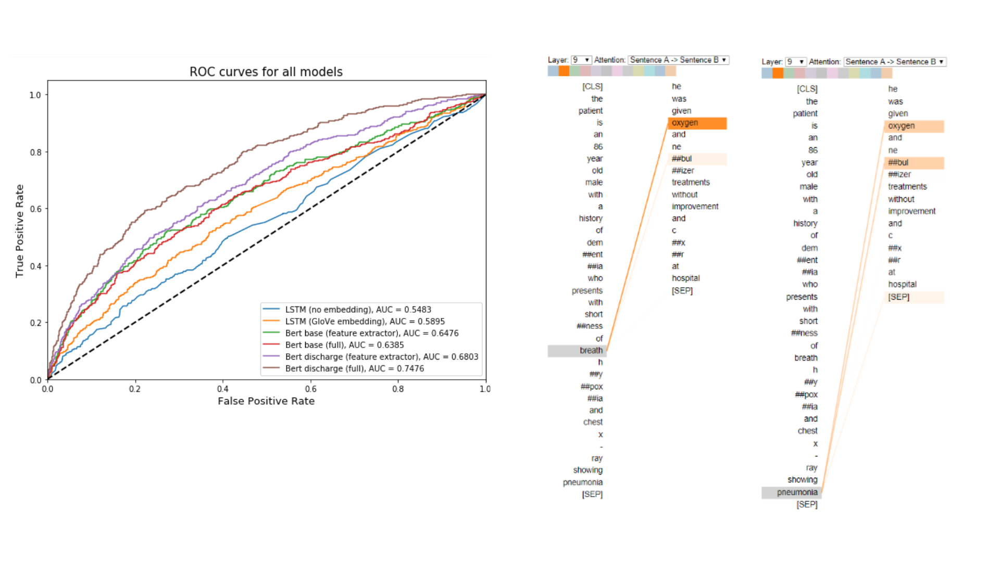

# Predicting Psychiatric Readmission from Clinical Notes  

**Authors**: Emmy Phung (mtp363@nyu.edu) and Kevin Yie (ky848@nyu.edu)  
**Data source**: MIMIC III (https://mimic.physionet.org/)  

**Abstract**

Rapid psychiatric readmissions present a burden for both the patients as well as the hospitals. Due to the difficulties in assessing mental health status and complications inherent to mental illnesses, premature discharges as well as rapid decay of mental status after discharge is an issue many psychiatric facilities faces. We aim to create a BERT-based model that can assist clinicians in identifying patients as risk of psychiatric readmission upon discharge as well as extract abstract relationships from discharge summaries.

**Models**:
- LSTM with no embedding (baseline)
- LSTM with GloVe embedding 
- BERT Base (as feature extractor)
- BERT Base (finetuned)
- BERT Discharge (as feature extractor)
- BERT Discharge (finetuned)

Please see our **Final Report** for details.

*Note: saved models can be found at: 
https://drive.google.com/drive/folders/1F9XzG6vewCEV9DFityUICVbkEz5vZPBR?usp=sharing*

